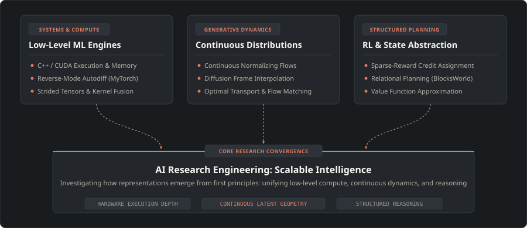

<!-- Header Banner with Dark Slate and Terracotta Palette -->

  
   
  
   
  
  &nbsp;
  

---

### 🧭 Research Statement

I am an engineer with a background in production-grade systems, concurrent pipelines, and distributed applications, now focused on **fundamental AI research and research engineering**. 

Rather than treating modern deep learning as a set of black-box APIs, I approach the field from **first principles**: analyzing how representations emerge, optimizing low-level tensor execution on hardware, and designing learning dynamics capable of generalizing beyond memorized patterns.

  

---

### 🔬 Core Research & Exploration Domains

* **Low-Level ML & Compute Engines**: Demystifying backpropagation and GPU compute by implementing tensor execution graphs, memory allocators, and custom CUDA kernels from scratch.
* **Generative Modeling & Neural Frame Synthesis**: Investigating diffusion models and continuous flows for temporal interpolation—synthesizing intermediate video frames conditioned on bidirectional temporal context.
* **Reinforcement Learning & Structured Planning**: Examining how policy and value networks operate in structured combinatorial environments (e.g., BlocksWorld), bridging symbolic reasoning with learned state-action representations.
* **Representation & Latent Geometry**: Understanding inductive biases, manifold regularization, and why learning-based systems capture underlying structure.

---

### 🛠️ In-Flight Projects & Implementations

<table>
  <tr>
    <td width="50%" valign="top">
      <h4>⚡ <code>MyTorch</code> — Deep Learning Framework in C++ & CUDA</h4>
      
A from-scratch, educational tensor computation engine and automatic differentiation framework designed to bridge hardware execution and deep learning theory.

      <ul>
        <li>Dynamic computation graph with reverse-mode autograd engine</li>
        <li>Custom CUDA kernels for matrix ops, activations, and reduction passes</li>
        <li>Memory pooling and strided N-dimensional tensor representations</li>
      </ul>
    </td>
    <td width="50%" valign="top">
      <h4>🎞️ Diffusion-Based Neural Frame Interpolation</h4>
      
Exploring score-based generative priors to synthesize high-fidelity intermediate video frames, targeting coherent motion estimation and occlusion handling.

      <ul>
        <li>Latent diffusion conditioned on preceding and succeeding frames</li>
        <li>Temporal attention blocks and optical flow consistency penalties</li>
        <li>Analysis of perceptual artifact minimization vs. pixel-level MSE</li>
      </ul>
    </td>
  </tr>
  <tr>
    <td width="50%" valign="top">
      <h4>🧱 Reinforcement Learning for Abstract Planning</h4>
      
Formulating deep and tabular RL methods to solve symbolic planning benchmarks (e.g., BlocksWorld) with sparse reward landscapes.

      <ul>
        <li>Value function approximation over relational state representations</li>
        <li>Hindsight Experience Replay (HER) and curriculum exploration</li>
        <li>Evaluating sample efficiency vs. classical heuristic search (A*, PDDL)</li>
      </ul>
    </td>
    <td width="50%" valign="top">
      <h4>📐 Paper Reproductions & Empirical Ablations</h4>
      
Clean, reproducible implementations of foundational literature with detailed logs of optimization behavior and loss surfaces.

      <ul>
        <li>Denoising Diffusion Probabilistic Models (DDPM / DDIM)</li>
        <li>Flow Matching and Continuous Normalizing Flows</li>
        <li>PPO / Actor-Critic dynamics on discrete control environments</li>
      </ul>
    </td>
  </tr>
</table>

---

### 💻 Technical Tooling

  <!-- Core ML / Frameworks -->
  
  
  
  
  
   
  <!-- Systems & Languages -->
  
  
  
  
  

---

### 📚 Research Tracker & Reading Log

  
<b>Current Literature Queue & Completed Deep Dives (Click to expand)</b>

   

| Field | Paper / Topic | Focus / Questions Under Investigation |
| :--- | :--- | :--- |
| **Generative Models** | *Denoising Diffusion Probabilistic Models (Ho et al.)* | Derivation of variational lower bound & noise scheduling |
| **Flow Matching** | *Flow Matching for Generative Modeling (Lipman et al.)* | Straight paths in optimal transport vs. Brownian diffusion |
| **Frame Generation** | *Diffusion Models for Video Generation & Interpolation* | Temporal cross-attention and latent space frame consistency |
| **RL & Planning** | *Reinforcement Learning in Relational Domains* | Value iteration vs. graph representations in BlocksWorld |
| **Systems / Hardware** | *Programming Massively Parallel Processors (Kirk & Hwu)* | Warp divergence, shared memory bank conflicts, tiling |

---

### 📊 GitHub Activity

  
  &nbsp;
  

  

  

---

  <i>"Curious about how machines learn structure, not just patterns."</i>

